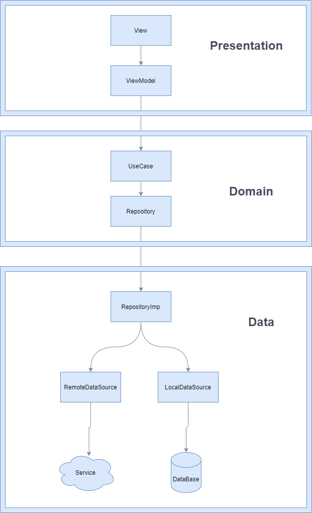
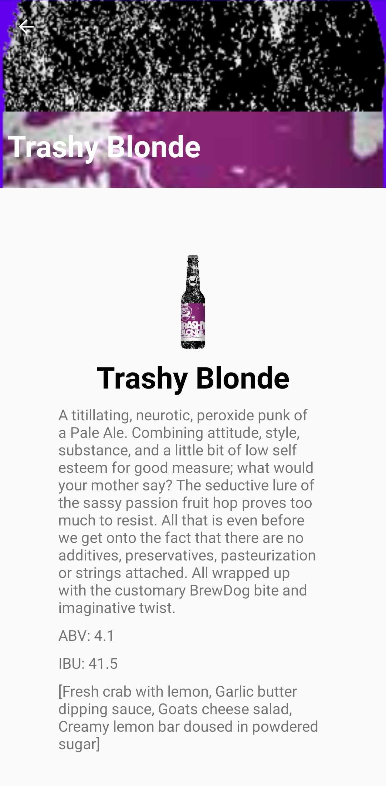
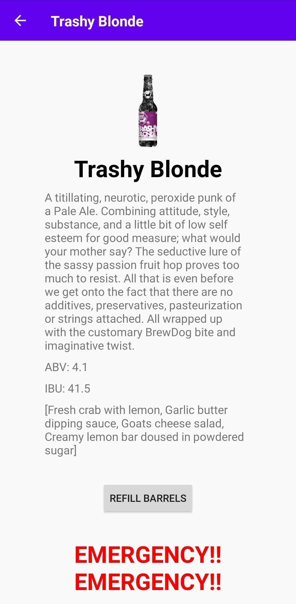
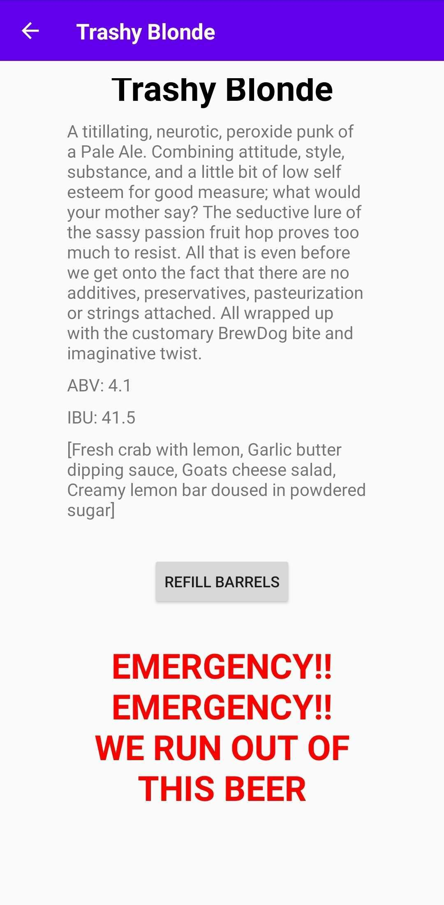

# BillionBeers

This is a base simple app that showcases my base Architecture and testing practices. It's started as a monolitic app in place of multi module to be easier to test new libraries and new ideas and you can see the progression of the multi modular approach. 

This app follows the Clean Architecture and using MVVM architecture for the presentation layer. The app uses kotlin dsl for dependency management and I use de_fayard_buildsrcversions_gradle_plugin plugin to manage the latest versions of the libraries I use. 

The dependency management plugin is not working too well with gradle 7.3 and also the buildSrc approach wasn't too efficient with a multi modular app so soon I'll be moving the app to use versions catalog with kotlin 1.6 and gradle 7.3.

The apps tech stack is: LiveData, Room, ViewModels, Dagger, constraint layout, motion layout, view binding, glide, Coroutines, Jetpack Navigation and safe args, Retrofit, okHttp, GSON, Material Design, webmockserver, mockk, junit4 (I stopped using junit5 because there were no logs in CI server), kluent, espresso

You can find the app in google play store (https://play.google.com/store/apps/details?id=com.simtop.billionbeers&hl=es&gl=US). 
Any download and 5 star is **greatly appreciated**

For UI Testing I used the Robot Pattern.

<!-- WIP -->
## W.I.P.

- [x] Version Catalog + gradle 7.3 + kotlin 1.6 and updating libraries
- [ ] Centralizing Errors
- [ ] Try Github Actions and Dependabot
- [ ] Check if issue with UI Tests for paging 3.9 that I reported to google is fixed and merge paging branch
- [ ] Add Jacoco to sonar qube
- [ ] Add Firebase Test Lab with dynamic feature

Contributions are what make the open source community such an amazing place to learn, inspire, and create. Any contributions you make are **greatly appreciated** and it will be a pleasure to collaborate with you..

If you have a suggestion that would make this better, please fork the repo and create a pull request. You can also simply open an issue with the tag "enhancement".
Don't forget to give the project a star! Thanks again!

(<a href="#top">back to top</a>)

<!-- Project Progression and it's branches -->

## Project Progression

Master has the 7th Branch of Sonar Qube. I recommend to always compare old branches with master because many small bugs were fixed in master and also it contains the best approaches that old branches may not contain.

1. Monolithic App with dagger2 : https://github.com/simtop/BillionBeers/tree/simple_coroutines_monolith
2. Hilt Monolith : https://github.com/simtop/BillionBeers/tree/feature/hilt_monolith 
   (The sub branches of the Monolith are not included in the next simple multi module approach because of UI Test Issue reported to google) 
   1. Flow branch(Using State Flow) : https://github.com/simtop/BillionBeers/tree/feature/flow
   2. Just Network Paging 3.0 : https://github.com/simtop/BillionBeers/tree/feature/network_paging
   3. Network + Room Paging 3.0 : https://github.com/simtop/BillionBeers/tree/feature/network_room_paging
3. Simpler Multi Module Approach with Hilt : https://github.com/simtop/BillionBeers/tree/feature/multimodule_hilt
4. Complete hilt Multi Module : https://github.com/simtop/BillionBeers/tree/feature/complete_hilt_multimodule
5. Installed Dynamic Feature : https://github.com/simtop/BillionBeers/tree/feature/dynamic_feature
6. Dynamic Feature Module on Demand : https://github.com/simtop/BillionBeers/tree/feature/dynamic_feature_on_demand
7. Sonar Qube : https://github.com/simtop/BillionBeers/tree/feature/sonar_qube
8. Sonar Qube + Jacoco (Still work in progress) : https://github.com/simtop/BillionBeers/tree/feature/wip_jacoco_sonarqube
9. Migration to Jetpack Compose : https://github.com/simtop/BillionBeers/tree/feature/compose

(<a href="#top">back to top</a>)

Architecture Summary:

(<a href="#top">back to top</a>)

Here are images of the app:

(<a href="#top">back to top</a>)

