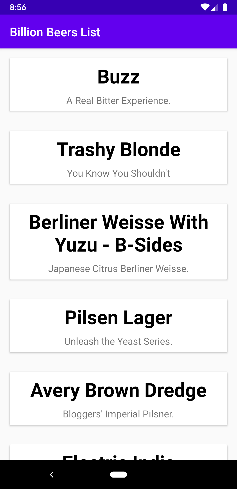
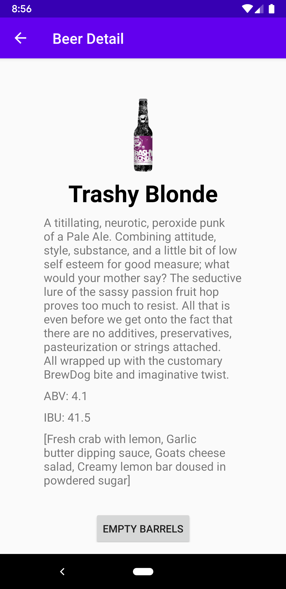
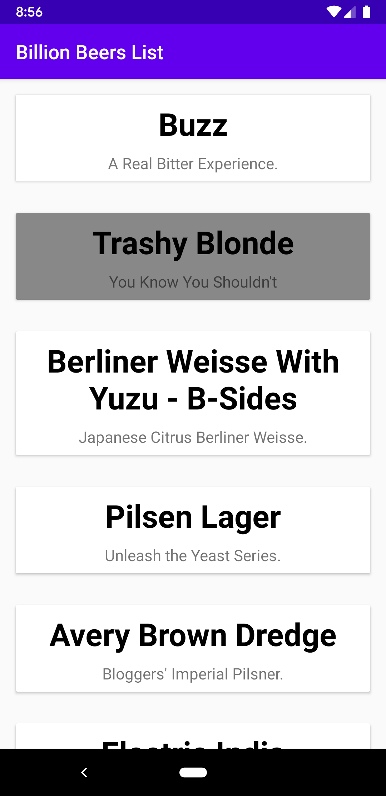

# BillionBeers

This is a base simple app that showcases my base Architecture and testing practices. It's done as a monolitic app in place of multi module to be easier to test new libraries and new ideas. There is another similar app using multi module architecture that will be published soon, right now is published in Google Play Store as an alpha with CI/CD. 

This app follows the Clean Architecture and using MVVM architecture for the presentation layer. The app uses kotlin dsl for dependency management and I use de_fayard_buildsrcversions_gradle_plugin plugin to manage the latest versions of the libraries I use.

The apps tech stack is: LiveData, Room, ViewModels, Dagger, constraint layout, view binding, glide, Coroutines, Jetpack Navigation and safe args, Retrofit, okHttp, GSON, Material Design, webmockserver, mockk, junit4 (I stopped using junit5 because there were no logs in CI server), kluent, espresso

WIP: centralizing errors in the repository and paging 3.0.

Here are images of the app:

