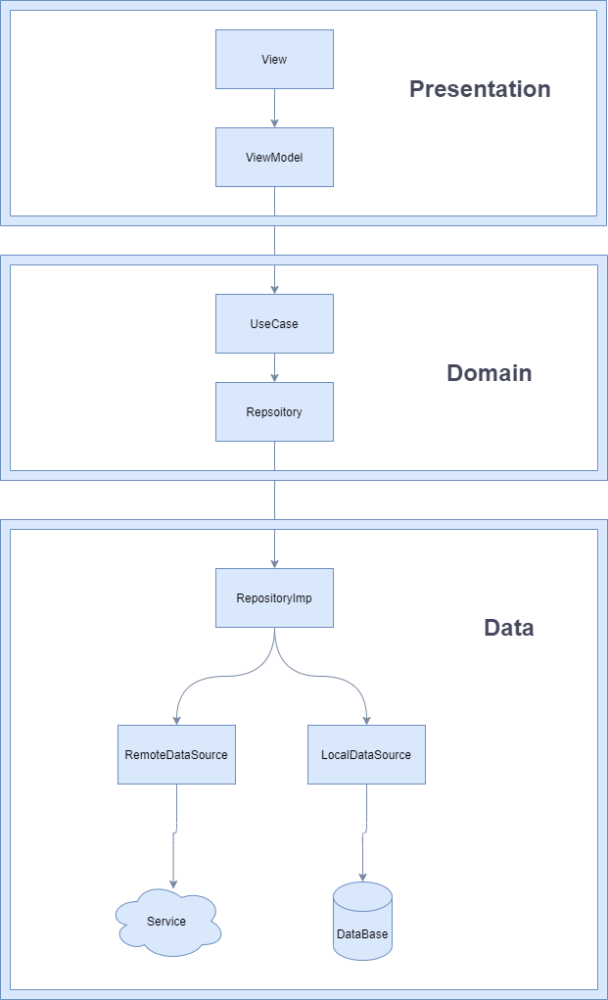

# BillionBeers

This is a multi-module Android application that showcases modern architecture and testing practices. It follows Clean Architecture principles and uses MVVM for the presentation layer.

This app follows the Clean Architecture and uses MVVM architecture for the presentation layer. The app uses Kotlin DSL for dependency management and Version Catalog to manage library versions.

The app's tech stack is: Jetpack Compose, StateFlow, Room, ViewModels, Hilt, Coroutines, Jetpack Navigation and safe args, Retrofit, okHttp, GSON, Material Design, webmockserver, mockk, junit4, Strikt, Espresso.

You can find the app in google play store (https://play.google.com/store/apps/details?id=com.simtop.billionbeers&hl=es&gl=US). 
Any download and 5 star is **greatly appreciated**

For UI Testing I used the Robot Pattern.


## Code Quality & Reports

This project uses several tools to ensure code quality and consistency.

### 1. Formatting (Spotless & ktfmt)
We use **Spotless** with **ktfmt** to enforce Google's Kotlin style guide.
- **Check formatting**: `./gradlew spotlessCheck`
- **Apply formatting**: `./gradlew spotlessApply` (Run this before committing!)

### 2. Static Analysis (Detekt)
We use **Detekt** to find code smells and complexity issues.
- **Run analysis**: `./gradlew detekt`
- **Reports**: Found in `build/reports/detekt/` for each module (e.g., `app/build/reports/detekt/detekt.html`).

### 3. Code Coverage (Jacoco)
We use **Jacoco** to measure test coverage.
- **Generate reports**: `./gradlew jacocoTestReport`
- **Reports**: Found in `build/reports/jacoco/jacocoTestReport/html/index.html` for each module (e.g., `core-common/build/reports/jacoco/jacocoTestReport/html/index.html`).

### 4. Screenshot Testing (Paparazzi)
We use **Paparazzi** for screenshot testing our Compose UI.
- **Record specific module**: `./gradlew :feature:beerdetail:recordPaparazziDebug`
- **Verify specific module**: `./gradlew :feature:beerdetail:verifyPaparazziDebug`
- **Record all modules**: `./gradlew recordPaparazziDebug`
- **Verify all modules**: `./gradlew verifyPaparazziDebug`
- **Clean and record**: `./gradlew cleanRecordPaparazziDebug`
- **Reports**: Found in `build/reports/paparazzi/` for each module.

### 5. Performance Measurement & Profiling

This project includes a robust system for measuring and improving performance.

#### A. Gradle Build Profiling (Build Speed)
We use **Gradle Profiler** to automate build measurements.
- **Requirement**: `brew install gradle-profiler`
- **Run benchmark**: 
  ```bash
  gradle-profiler --benchmark --scenario-file ./benchmark.scenarios incremental_build
  ```
- **Scenarios**: Defined in `benchmark.scenarios` (Clean build, Incremental, etc.).

#### B. Microbenchmarking (Code Logic)
Measure the performance of CPU-bound logic (e.g., `BeersMapper`).
- **Run**: `./gradlew :benchmark:microbenchmark:connectedCheck`
- **Reports**: `benchmark/microbenchmark/build/reports/androidTests/connected/release/index.html`

#### C. Macrobenchmarking (App Startup & Jank)
Measure high-level user experience like App Startup and Scrolling.
- **Run**: `./gradlew :benchmark:macrobenchmark:connectedCheck`
- **Reports**: `benchmark/macrobenchmark/build/reports/androidTests/connected/debug/index.html`
- **Notes**: 
  - Uses a dedicated `benchmark` build type (minified but debug-signed).
  - Macrobenchmarks requires a physical device for accurate frame timing results.
  - Suppression rules are enabled in `gradle.properties` for local emulator testing.

#### D. Interpreting Results
- **Micro**: Focus on **Median** time and **Allocations** (aim for 0 allocs in hot loops).
- **Macro**: Aim for Cold Startup **< 500ms** and Frame Overrun **0ms** (perfect 60fps).


Contributions are what make the open source community such an amazing place to learn, inspire, and create. Any contributions you make are **greatly appreciated** and it will be a pleasure to collaborate with you..

If you have a suggestion that would make this better, please fork the repo and create a pull request. You can also simply open an issue with the tag "enhancement".
Don't forget to give the project a star! Thanks again!

<p align="right">(<a href="#top">back to top</a>)</p>

[](https://deepwiki.com/simtop/BillionBeers)

<p align="right">(<a href="#top">back to top</a>)</p>

Architecture Summary:



<p align="right">(<a href="#top">back to top</a>)</p>

Here are images of the app:


<p align="right">(<a href="#top">back to top</a>)</p>
