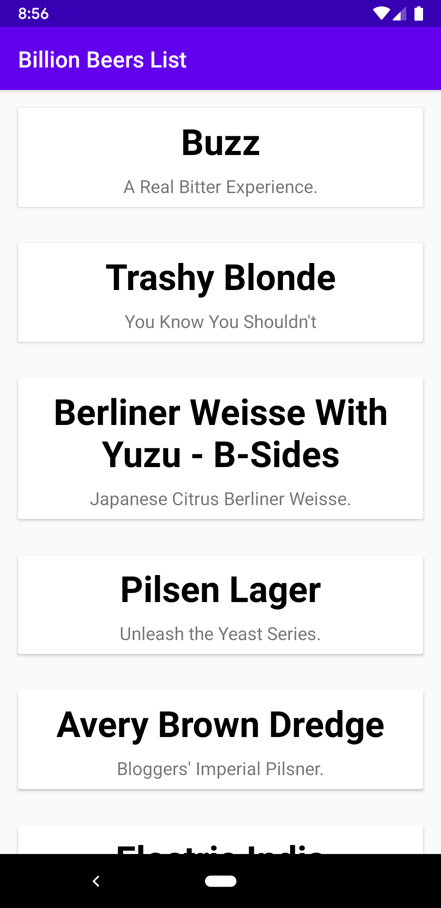
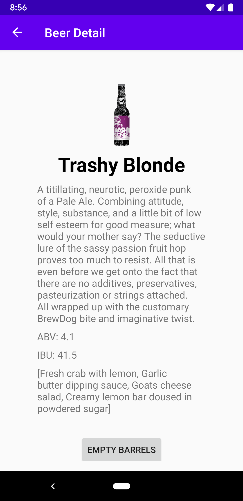
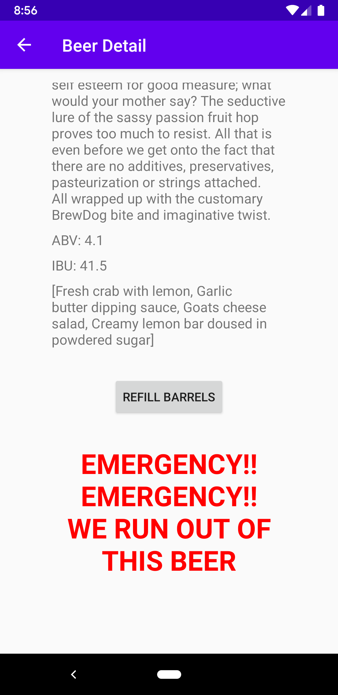
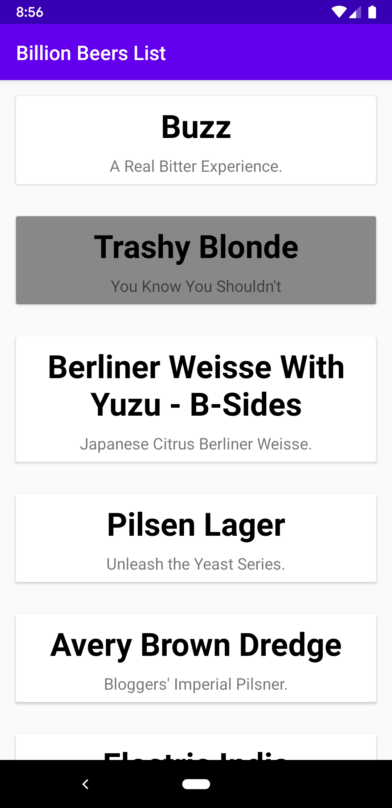
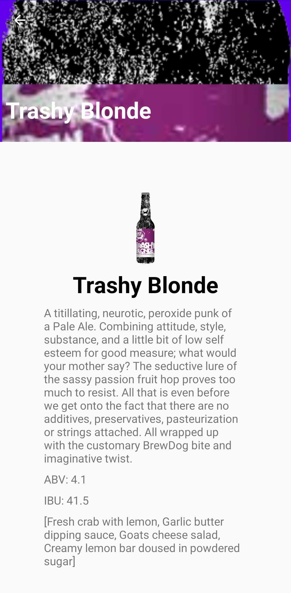
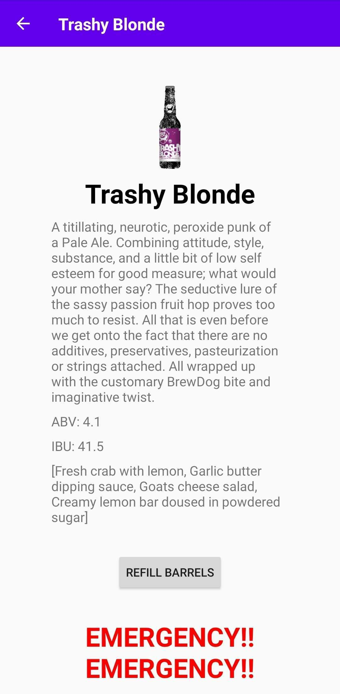
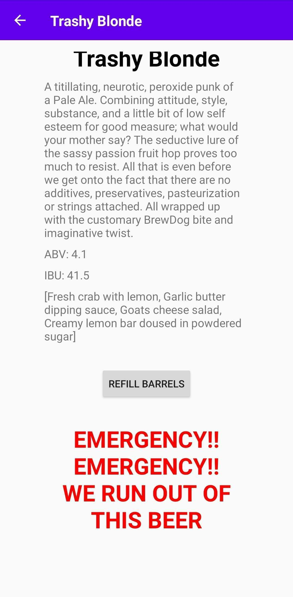
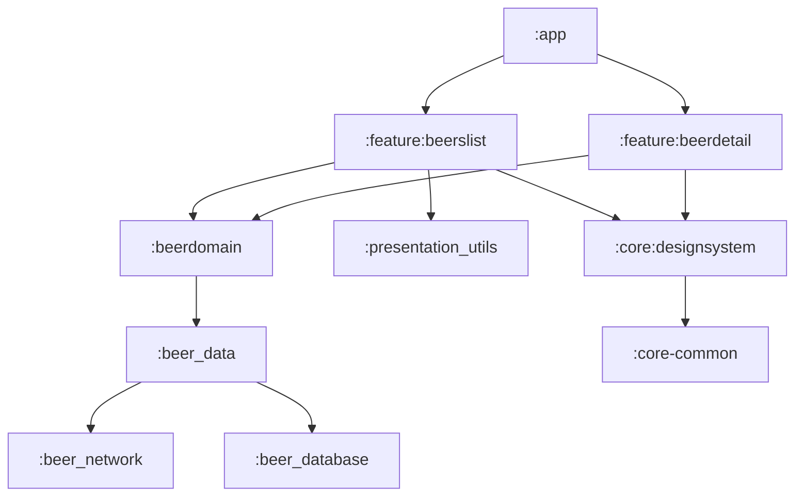
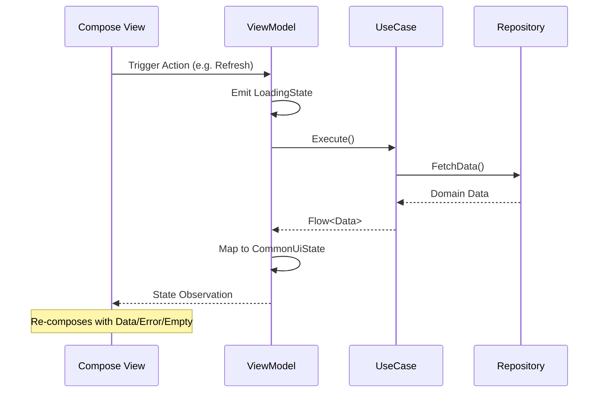

# BillionBeers 🍻

BillionBeers is a state-of-the-art multi-module Android application showcasing modern architecture, reactive UI patterns, and comprehensive testing strategies. 

[](https://play.google.com/store/apps/details?id=com.simtop.billionbeers)
[](https://deepwiki.com/simtop/BillionBeers)

---

## 📸 Visual Tour

Discover the "BillionBeers" experience through these high-fidelity screenshots:

````carousel

<!-- slide -->

<!-- slide -->

<!-- slide -->

<!-- slide -->

<!-- slide -->

<!-- slide -->

````

---

## 🏗 Architecture & Design Patterns

The project follows **Clean Architecture** principles with a robust **Multi-module** structure, ensuring high scalability and separation of concerns.

### High-Level Module Dependency

```mermaid
graph TD
    App[":app"] --> FeatureA[":feature:beerslist"]
    App --> FeatureB[":feature:beerdetail"]
    
    FeatureA --> Domain[":beerdomain"]
    FeatureB --> Domain
    FeatureA --> PresentationUtils[":presentation_utils"]
    
    Domain --> Data[":beer_data"]
    Data --> Network[":beer_network"]
    Data --> DB[":beer_database"]
    
    FeatureA --> DesignSystem[":core:designsystem"]
    FeatureB --> DesignSystem
    
    DesignSystem --> CoreCommon[":core-common"]
```

### Feature-Level: Unidirectional Data Flow (UDF)
Every feature utilizes a pure UDF pattern powered by Kotlin Flow and Compose's state management.


```mermaid
sequenceDiagram
    participant UI as Compose View
    participant VM as ViewModel
    participant UC as UseCase
    participant Repo as Repository

    UI->>VM: Trigger Action (e.g. Refresh)
    VM->>VM: Emit LoadingState
    VM->>UC: Execute()
    UC->>Repo: FetchData()
    Repo-->>UC: Domain Data
    UC-->>VM: Flow<Data>
    VM->>VM: Map to CommonUiState
    VM-->>UI: State Observation
    Note over UI: Re-composes with Data/Error/Empty
```

---

## 🛠 Advanced Technology Stack

This project goes beyond standard libraries, incorporating advanced engineering tools:

- **UI**: Jetpack Compose with a **Component Catalog** (annotation-driven demo system).
- **DI**: **Metro** — A cutting-edge, high-performance dependency injection framework for dynamic features.
- **Testing**:
    - **Paparazzi**: JVM-based Snapshot Testing. It renders your Composables directly on the JVM using Android Studio's `LayoutLib`, allowing for lightning-fast regression testing without emulators.
    - **Robot Pattern**: Standardized E2E/UI testing architecture for readability.
- **Data**: Room, Retrofit, Kotlin Serialization, Paging(custom mediator logic).
- **Quality**: Detekt, Spotless, Jacoco (Unified Root Reporting).

---

## 🚀 Project Evolution

<details>
<summary><b>Click to explore the technological journey (21+ Milestones)</b></summary>

This repository has served as a technological sandbox over the years. You can explorer the project's history through these significant milestones:

1.  **[Monolithic App with Dagger2](https://github.com/simtop/BillionBeers/tree/simple_coroutines_monolith)**: The original project structure.
2.  **[Hilt Monolith](https://github.com/simtop/BillionBeers/tree/feature/hilt_monolith)**: Transitioning to modern DI.
    *   [StateFlow Implementation](https://github.com/simtop/BillionBeers/tree/feature/flow)
    *   [Paging 3 (Network Only)](https://github.com/simtop/BillionBeers/tree/feature/network_paging)
    *   [Paging 3 (Network + Room)](https://github.com/simtop/BillionBeers/tree/feature/network_room_paging)
3.  **[Simple Multi-Module (Hilt)](https://github.com/simtop/BillionBeers/tree/feature/multimodule_hilt)**: First architectural split.
4.  **[Complete Multi-Module Architecture](https://github.com/simtop/BillionBeers/tree/feature/complete_hilt_multimodule)**: Mature layered separation.
5.  **[Standard Dynamic Features](https://github.com/simtop/BillionBeers/tree/feature/dynamic_feature)**: Base implementation of Play Core features.
6.  **[On-Demand Dynamic Features](https://github.com/simtop/BillionBeers/tree/feature/dynamic_feature_on_demand)**: Advanced lazy loading.
7.  **[SonarQube Integration](https://github.com/simtop/BillionBeers/tree/feature/sonar_qube)**: Static analysis at scale.
8.  **[SonarQube + Jacoco](https://github.com/simtop/BillionBeers/tree/feature/wip_jacoco_sonarqube)**: Unified coverage reporting.
9.  **[Jetpack Compose Migration](https://github.com/simtop/BillionBeers/tree/feature/compose)**: Modernizing the entire UI layer.
10. **[Kotlin DSL (KTS) Migration](https://github.com/simtop/BillionBeers/tree/feat/gradle-kts-conversion)**: Type-safe Gradle configuration.
11. **[Centralized Version Catalog](https://github.com/simtop/BillionBeers/tree/feature/version_catalog)**: Managing dependencies in a single `toml` file.
12. **[Build Logic Unification](https://github.com/simtop/BillionBeers/tree/feature/convention-to-precompiled-gradle-scripts)**: Industry-standard precompiled script plugins.
13. **[Design System Catalog](https://github.com/simtop/BillionBeers/tree/demo-catalog-app)**: Standalone component documentation app.
14. **[Baseline Profiles](https://github.com/simtop/BillionBeers/tree/baseline-profile)**: DEX layout optimization for app startup.
15. **[Dependency Auditing](https://github.com/simtop/BillionBeers/tree/dependencies-checker-plugin)**: Custom plugin for unused dep detection.
16. **[Advanced R8 Aggressiveness](https://github.com/simtop/BillionBeers/tree/feature/r8-rules)**: Maximum code shrinking and obfuscation.
17. **[KSP Compose Processing](https://github.com/simtop/BillionBeers/tree/feature/compose-manual-update-finished-ksp)**: Transitioning from KAPT to KSP for build speed.
18. **[Full Compose Navigation](https://github.com/simtop/BillionBeers/tree/feature/nav3-full-compose)**: Migration to type-safe Compose Nav.
19. **[Assisted Inject Experiments](https://github.com/simtop/BillionBeers/tree/feature/assisted_inject_experiments_hilt)**: Dynamic parameters in DI.

</details>

---

## 📊 Current Stack Versions

> [!NOTE]
> This section is automatically kept in sync with the codebase via `make update-docs`.

<!-- START_VERSIONS -->
| Tech | Version |
| :--- | :--- |
| **Kotlin** | 2.2.20 |
| **Gradle** | 8.14 |
| **Compose BOM** | 2025.05.01 |
| **Metro DI** | 0.11.2 |
| **Room DB** | 2.7.1 |
<!-- END_VERSIONS -->

---

To simplify development, we use a standardized **Makefile**. Run `make help` to see all available commands.

> [!TIP]
> You can target specific modules using the `MODULE` variable:
> `make test MODULE=:feature:beerslist`

- **Build/Install**: `make build`, `make install`
- **Testing**: `make test`, `make ui-test`
- **Screenshots**: `make screenshot-record`, `make screenshot-verify`
- **Analysis**: `make check-unused-deps`, `make check-duplicates`
- **Benchmarking**: `make benchmark-macro`, `make gradle-benchmark SCENARIO=clean_build`

---

## 🤝 Contributing

Contributions are what make the open-source community such an amazing place to learn, inspire, and create. Any contributions you make are **greatly appreciated**.

1. Fork the Project
2. Create your Feature Branch (`git checkout -b feature/AmazingFeature`)
3. Commit your Changes (`git commit -m 'Add some AmazingFeature'`)
4. Push to the Branch (`git push origin feature/AmazingFeature`)
5. Open a Pull Request

---

<p align="center">
  Built with ❤️ by Simon Topchyan
</p>
