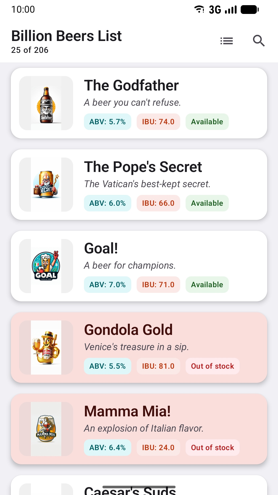
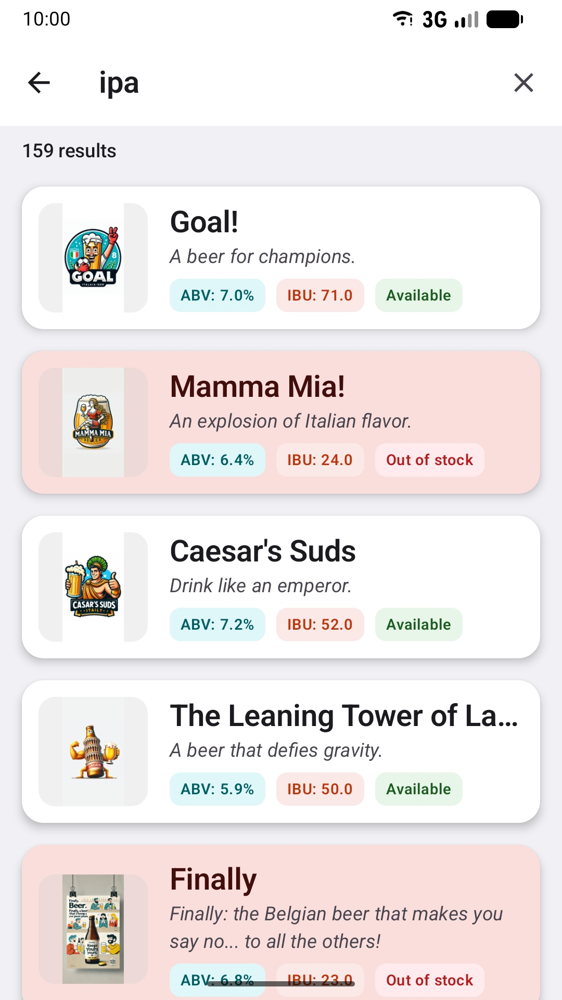
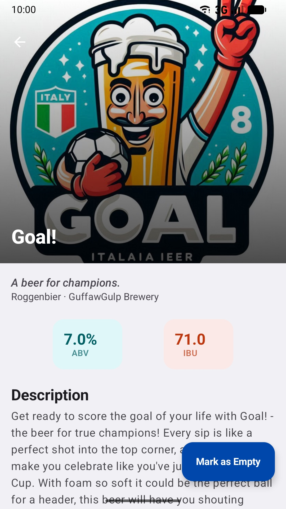
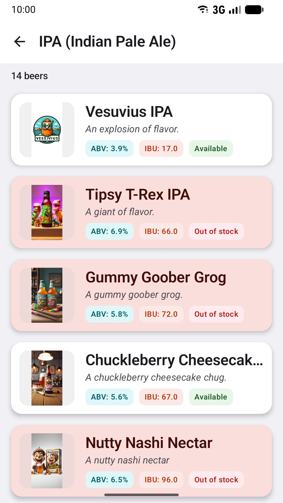
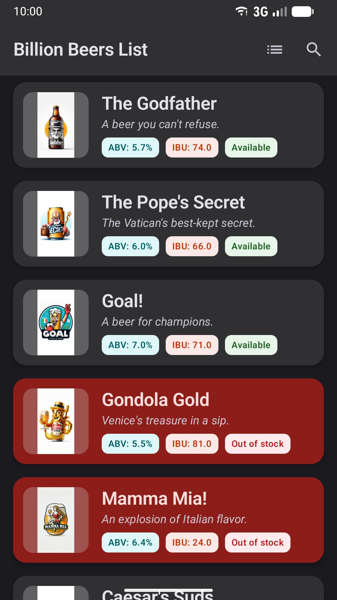
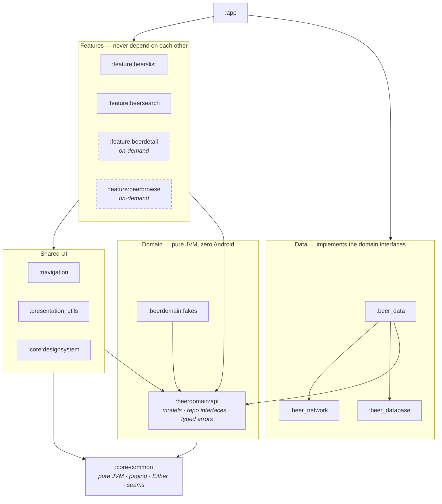
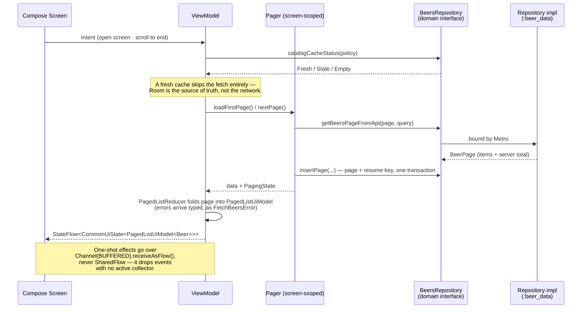

# BillionBeers 🍻

A production-shaped, multi-module Android app — a beer catalog — used as a proving ground for modern
Android architecture. **The shape is the product:** the boundaries that matter here fail the build
rather than fail a code review, and the decisions that are easy to second-guess are written down as
ADRs instead of argued twice.

Compose UI · Metro DI · Room as SSOT · hand-rolled paging · two on-demand dynamic feature modules ·
architecture rules enforced by Konsist · JVM screenshot tests · dependency verification.

[](https://play.google.com/store/apps/details?id=com.simtop.billionbeers)
[](https://deepwiki.com/simtop/BillionBeers)

---

## 📸 Visual Tour

Captured from the current build with `scripts/play-listing.sh` — the same assets that go to the
Play Store, so they cannot quietly drift from the app again.

````carousel

<!-- slide -->

<!-- slide -->

<!-- slide -->

<!-- slide -->

````

---

## 🏗 Architecture & Design Patterns

The project follows **Clean Architecture** principles with a robust **Multi-module** structure, ensuring high scalability and separation of concerns.

### High-Level Module Dependency

Dependencies point **inwards**: features and data both depend on the domain, and the domain depends
on nothing but pure Kotlin. The load-bearing edges here — features never reaching each other, the
domain staying Android-free, data never leaking upwards — are checked by
[Konsist tests](#-enforced-architecture) on every push.


```mermaid
graph TD
    App[":app"]

    subgraph FEATURES ["Features — never depend on each other"]
        List[":feature:beerslist"]
        Search[":feature:beersearch"]
        Detail[":feature:beerdetail<br/><i>on-demand</i>"]
        Browse[":feature:beerbrowse<br/><i>on-demand</i>"]
    end

    subgraph SHARED ["Shared UI"]
        Nav[":navigation"]
        PresUtils[":presentation_utils"]
        Design[":core:designsystem"]
    end

    subgraph DATA ["Data — implements the domain interfaces"]
        Data[":beer_data"]
        Network[":beer_network"]
        DB[":beer_database"]
    end

    subgraph DOMAIN ["Domain — pure JVM, zero Android"]
        Api[":beerdomain:api<br/><i>models · repo interfaces · typed errors</i>"]
        Fakes[":beerdomain:fakes"]
    end

    CoreCommon[":core-common<br/><i>pure JVM · paging · Either · seams</i>"]

    App --> FEATURES
    App --> DATA
    FEATURES --> SHARED
    FEATURES --> Api
    SHARED --> Api
    Data --> Network
    Data --> DB
    Data --> Api
    Fakes --> Api
    Api --> CoreCommon
    SHARED --> CoreCommon

    classDef dyn stroke-dasharray: 5 5
    class Detail,Browse dyn
```

> [!NOTE]
> **The two dashed modules invert their build edge.** Android's `com.android.dynamic-feature`
> plugin requires an on-demand feature to declare `implementation(project(":app"))`, while `:app`
> lists it under `dynamicFeatures`. The *code* dependency still runs the direction drawn above —
> features never reach into `:app`, and cross-feature navigation goes through `:navigation`.
>
> Shared foundation dependencies (`:core`, `:core-common`, `:presentation_utils`,
> `:beerdomain:api`) are injected into every feature by the `billionbeers.android.feature`
> convention plugin rather than hand-declared per module.

### Feature-Level: Unidirectional Data Flow (UDF)

Every feature uses a pure UDF pattern powered by Kotlin Flow and Compose state. There is **no use
case layer** — ViewModels inject the domain repository interface directly, which is only safe
because a Konsist rule mechanically forbids a ViewModel from touching anything outside the domain
layer. The reasoning is written down in [ADR 0003](docs/adr/0003-use-case-policy.md).


```mermaid
sequenceDiagram
    participant UI as Compose Screen
    participant VM as ViewModel
    participant Pager as Pager (screen-scoped)
    participant Repo as BeersRepository<br/>(domain interface)
    participant Impl as Repository impl<br/>(:beer_data)

    UI->>VM: Intent (open screen · scroll to end)
    VM->>Repo: catalogCacheStatus(policy)
    Repo-->>VM: Fresh / Stale / Empty
    Note over VM: A fresh cache skips the fetch entirely —<br/>Room is the source of truth, not the network.
    VM->>Pager: loadFirstPage() / nextPage()
    Pager->>Repo: getBeersPageFromApi(page, query)
    Repo->>Impl: bound by Metro
    Impl-->>Repo: BeerPage (items + server total)
    Pager->>Repo: insertPage(...) — page + resume key, one transaction
    Pager-->>VM: data + PagingState
    VM->>VM: PagedListReducer folds page into PagedListUiModel<br/>(errors arrive typed, as FetchBeersError)
    VM-->>UI: StateFlow<CommonUiState<PagedListUiModel<Beer>>>
    Note over VM,UI: One-shot effects go over<br/>Channel(BUFFERED).receiveAsFlow(),<br/>never SharedFlow — it drops events<br/>with no active collector.
```

---

## 🛡 Enforced Architecture

The point of this repository is that **the conventions are enforced by tooling, not by memory**. A
diagram that only lives in a README rots; these rules fail the build. They run as
[Konsist](https://github.com/LemonAppDev/konsist) tests in the `:konsist` module, on every push.

| Rule | Test |
|---|---|
| Repository interfaces never import data-layer types | `RepositoryBoundaryTest` |
| Feature modules never depend on other feature modules — cross-feature nav goes through `:navigation` | `FeatureModuleBoundaryTest` |
| The domain layer has zero Android imports | `DomainLayerPurityTest` |
| ViewModels depend only on domain types (the precondition that makes "no use cases" safe) | `ViewModelBoundaryTest` |
| Dynamic features declare no resources of their own — they crash instrumented tests | `DynamicFeatureResourceBoundaryTest` |
| Dev-app sandboxes depend only on `api` + `fakes` modules, which is what keeps them fast | `DevAppDependencyBoundaryTest` |
| No module applies `java-test-fixtures` — fixtures live in sibling `:fakes` modules (ADR 0001) | `TestFixturesPluginBoundaryTest` |
| ViewModels never use `MutableSharedFlow` — it drops one-shot events when nothing is collecting | `OneShotEventBoundaryTest` |
| Domain models are immutable — no `var`, and no `val` holding a mutable collection | `DomainModelImmutabilityTest` |
| A module with `src/androidTest/` opts into the managed device — otherwise its tests compile, read as coverage, and never run | `InstrumentedTestOptInBoundaryTest` |

Reinforced by:

- **Supply chain** — Gradle dependency verification with a checked-in ledger (211 locked deps),
  `dependency-guard` on the resolved graph, GitHub Actions pinned to SHAs, and gitleaks on every PR
  range. See [ADR 0006](docs/adr/0006-ci-supply-chain-hardening.md) and
  [ADR 0007](docs/adr/0007-gradle-dependency-verification.md).
- **Convention plugins** — module setup lives in `build-logic`, so a new feature module is a plugin
  id and a namespace, not a copied 80-line build script.
- **Decision record** — eleven [ADRs](docs/adr/) covering the choices that are easy to second-guess:
  no Paging3, no `java-test-fixtures`, no use-case layer — and
  [ADR 0010](docs/adr/0010-non-goals.md), which records the capabilities this project deliberately
  *doesn't* have (auth, pinning, push, background sync) and the premise each one is waiting on, so
  a deliberate absence never has to be mistaken for an oversight.
- **Dev-app sandboxes** — `app-dev-<feature>` modules build a single feature against fakes for fast
  iteration (`make new-dev-app`).
- **A budget on the build itself, not just the app** — `make build-budget` measures clean,
  incremental and test builds with gradle-profiler and checks them against
  `config/build-time-budget.txt`. Clean build is 37s cold and 4s warm; a deep ABI change costs
  1.11x a leaf one, which says per-build overhead dominates and further module splitting would not
  make builds faster. It runs locally, never in CI, because a CI wall-clock number mostly measures
  which runner the job drew. See [ADR 0011](docs/adr/0011-build-time-budget.md).
- **CI that runs only what a change can break** — a push to a PR reruns the test lanes its diff can
  affect, plus any lane that was red on the previous head; unaffected green lanes adopt their
  previous verdict, and a docs-only PR skips the heavy lanes entirely. The rules live in one
  function, so changing what runs when is a single edit. See
  [ADR 0008](docs/adr/0008-per-lane-ci-test-selection.md).

---

## 🛠 Advanced Technology Stack

This project goes beyond standard libraries, incorporating advanced engineering tools:

- **UI**: Jetpack Compose with a **Component Catalog** (annotation-driven demo system).
- **DI**: **Metro** — A cutting-edge, high-performance dependency injection framework for dynamic features.
- **Testing**:
    - **Paparazzi**: JVM-based Snapshot Testing. It renders your Composables directly on the JVM using Android Studio's `LayoutLib`, allowing for lightning-fast regression testing without emulators.
    - **Robot Pattern**: Standardized E2E/UI testing architecture for readability.
- **Data**: Room (SSOT), Retrofit, Kotlin Serialization, and a **hand-rolled `PagingMediator`** —
  Paging 3 was deliberately dropped because `PagingData` leaks through every layer
  ([ADR 0002](docs/adr/0002-hand-rolled-paging.md)).
- **Errors**: typed sealed errors carried in `Either<DomainError, T>`, converted at the data boundary
  — never an untyped `Exception` on the left.
- **Quality**: Konsist (architecture), Detekt, Spotless, Jacoco (Unified Root Reporting),
  dependency-guard, macrobenchmark perf budgets, and Baseline Profiles.

---

## 🚀 Project Evolution

<details>
<summary><b>Click to explore the technological journey (19 Milestones)</b></summary>

This repository has served as a technological sandbox over the years. Each milestone below is a
live branch you can check out and read:

1.  **[Monolithic App with Dagger2](https://github.com/simtop/BillionBeers/tree/simple_coroutines_monolith)**: The original project structure.
2.  **[Hilt Monolith](https://github.com/simtop/BillionBeers/tree/feature/hilt_monolith)**: Transitioning to modern DI.
    *   [StateFlow Implementation](https://github.com/simtop/BillionBeers/tree/feature/flow)
    *   [Paging 3 (Network Only)](https://github.com/simtop/BillionBeers/tree/feature/network_paging)
    *   [Paging 3 (Network + Room)](https://github.com/simtop/BillionBeers/tree/feature/network_room_paging)
3.  **[Simple Multi-Module (Hilt)](https://github.com/simtop/BillionBeers/tree/feature/multimodule_hilt)**: First architectural split.
4.  **[Complete Multi-Module Architecture](https://github.com/simtop/BillionBeers/tree/feature/complete_hilt_multimodule)**: Mature layered separation.
5.  **[Standard Dynamic Features](https://github.com/simtop/BillionBeers/tree/feature/dynamic_feature)**: Base implementation of Play Core features.
6.  **[On-Demand Dynamic Features](https://github.com/simtop/BillionBeers/tree/feature/dynamic_feature_on_demand)**: Advanced lazy loading.
7.  **[SonarQube Integration](https://github.com/simtop/BillionBeers/tree/feature/sonar_qube)**: Static analysis at scale.
8.  **[SonarQube + Jacoco](https://github.com/simtop/BillionBeers/tree/feature/wip_jacoco_sonarqube)**: Unified coverage reporting.
9.  **[Jetpack Compose Migration](https://github.com/simtop/BillionBeers/tree/feature/compose)**: Modernizing the entire UI layer.
10. **[Kotlin DSL (KTS) Migration](https://github.com/simtop/BillionBeers/tree/feat/gradle-kts-conversion)**: Type-safe Gradle configuration.
11. **[Centralized Version Catalog](https://github.com/simtop/BillionBeers/tree/feature/version_catalog)**: Managing dependencies in a single `toml` file.
12. **[Build Logic Unification](https://github.com/simtop/BillionBeers/tree/feature/convention-to-precompiled-gradle-scripts)**: Industry-standard precompiled script plugins.
13. **[Design System Catalog](https://github.com/simtop/BillionBeers/tree/demo-catalog-app)**: Standalone component documentation app.
14. **[Baseline Profiles](https://github.com/simtop/BillionBeers/tree/baseline-profile)**: DEX layout optimization for app startup.
15. **[Dependency Auditing](https://github.com/simtop/BillionBeers/tree/dependencies-checker-plugin)**: Custom plugin for unused dep detection.
16. **[Advanced R8 Aggressiveness](https://github.com/simtop/BillionBeers/tree/feature/r8-rules)**: Maximum code shrinking and obfuscation.
17. **[KSP Compose Processing](https://github.com/simtop/BillionBeers/tree/feature/compose-manual-update-finished-ksp)**: Transitioning from KAPT to KSP for build speed.
18. **[Full Compose Navigation](https://github.com/simtop/BillionBeers/tree/feature/nav3-full-compose)**: Migration to type-safe Compose Nav.
19. **[Assisted Inject Experiments](https://github.com/simtop/BillionBeers/tree/feature/assisted_inject_experiments_hilt)**: Dynamic parameters in DI.

Everything after this point landed on `master` rather than on its own branch — the Metro DI
migration, Navigation 3, the hand-rolled paging layer, on-demand dynamic-feature install handling,
the Konsist rule set, Gradle dependency verification, and per-lane CI test selection. Read
`docs/adr/` for the decisions and `git log` for the work.

</details>

---

## 📊 Current Stack Versions

> [!NOTE]
> Generated by `make update-docs`, and CI fails if this table drifts from `libs.versions.toml`.
> So it is accurate by construction rather than by anyone remembering.

<!-- START_VERSIONS -->
| Tech | Version |
| :--- | :--- |
| **Kotlin** | 2.4.10 |
| **Gradle** | 9.6.1 |
| **Compose BOM** | 2026.06.01 |
| **Metro DI** | 1.3.2 |
| **Room DB** | 2.8.4 |
<!-- END_VERSIONS -->

---

To simplify development, we use a standardized **Makefile**. Run `make help` to see all available commands.

> [!TIP]
> You can target specific modules using the `MODULE` variable:
> `make test MODULE=:feature:beerslist`

- **Build/Install**: `make build`, `make install`
- **Testing**: `make test`, `make ui-test`
- **Screenshots**: `make screenshot-record`, `make screenshot-verify`
- **Analysis**: `make check-unused-deps`, `make check-duplicates`
- **Benchmarking**: `make benchmark-macro`, `make gradle-benchmark SCENARIO=clean_build`

---

## 🤝 Contributing

Contributions are what make the open-source community such an amazing place to learn, inspire, and create. Any contributions you make are **greatly appreciated**.

1. Fork the Project
2. Create your Feature Branch (`git checkout -b feature/AmazingFeature`)
3. Commit your Changes (`git commit -m 'Add some AmazingFeature'`)
4. Push to the Branch (`git push origin feature/AmazingFeature`)
5. Open a Pull Request

---

<p align="center">
  Built with ❤️ by Simon Topchyan
</p>
